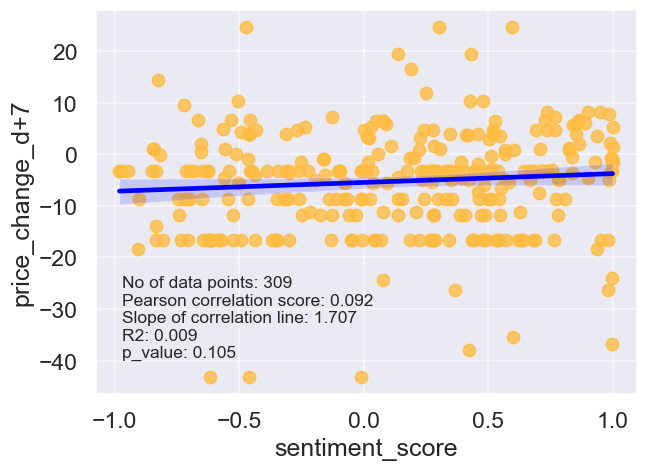

Please view the [slide deck](https://docs.google.com/presentation/d/e/2PACX-1vTk2uzgKXg3ihJK_qH6Woyv1xC5tjKljMW7dDOSQ1-yOMP43HEBWVFczLWz7uyMWMU0e75lEMlDvGfE/pub?start=false&loop=false) for a more consolidated explanation of the project.

# Problem Statement

## Project Objective
Our clients (Robinhood Markets Inc.) aims to expand its services from serving short-term options/stocks traders (such as those found in r/WallStreetBets) and start serving long-term investors (such as those found in r/stocks).  However, since these two subreddits have different interests, jargons, and audience, they would need to properly target the advertisement to the correct subreddit (r/WallStreetBets would not be interested in long-term investment). Hence, we are tasked with developing a model that can classify whether a post belongs to to subreddit r/WallStreetBets or r/stocks, In order to serve the correct post with the corresponding advertisement.

## Introduction:
r/WallStreetBets (also known as r/wsb) is a subreddit for discussing stocks and option trading. It has become notable for its colorful and profane jargon, aggressive trading strategies, harassment, and for playing a major role in the GameStop short squeeze that caused losses for some US firms and short sellers in a few days in early 2021 [[1]](https://en.wikipedia.org/wiki/R/wallstreetbets). The posts in r/wsb is dominated with memes, propsal/ideas for extremely risky stock/option plays, as well as reports about massive gains/losses from said plays. 

On the other hand r/stocks is a subreddit for for a more serious discussion on stocks and options, where the participants usually posts analysis and discussions on various stocks and companies. Discussions on highly risky plays on stocks with low capitalization and volume (typically known as "Penny Stocks") are outright banned in the subreddit. Instead, the type of discussions conducted at stocks is more geared towards serious long-term investments, which is spcifically the target of Robinhood's new expansion plan.

## Scope:
For this project, will be scraping all the posts from both subreddits in the period between August 2021 to August 2022. The reason for selecting this particular time period is because several months prior to August 2021, the majority of the discussions in both subreddits are still revolving around the GameStop short squeeze [[2]](https://en.wikipedia.org/wiki/GameStop_short_squeeze). The jargon, vocabulary, and talking points of this particular topic is quite different compared to subsequent topics. As such we have decided to not include the discussion of this particular topic on the analysis and classification project.

## Success Evaluation:
The difficulty for this task comes from the fact that this is a highly imbalanced classification problem. There are nearly 5x more posts coming from r/WSB then they are from r/stocks. As such using the simple accuracy metric (i.e.: ratio of correct predictions) would result in an erroneously high performance metric. For this project we'll be focusing on the precision and recall [[3]](https://en.wikipedia.org/wiki/Precision_and_recall) in predicting the target class. The following are the metric definition in the context of advertising to the target class:
- True positive: correctly classifying and serving the advertisement to the target class (r/stocks)
- False positive: incorrectly classifying the target class (r/stocks), and instead serving the advertisment to the wrong subreddit (r/wsb)
- True negative: correctly clasifying the other class (r/wsb) and not serving the advertisement
- False negative: incorrectly classifying the other class (r/wsb) which resulted in not serving the advertisement to the target class (r/stocks)
- Precision: ratio of advertisement served to the correct class
- Recall: ratio of posts in the correct class that is correctly served the advertisement

Based on the definitions above we are aiming to strike a balance between precision and recall, where the client is able to have a wide enough coverage in serving the advertisement to the target class (recall) while still maintaining a good enough precision so as not to waste the advertising budget on the wrong class. As such, we can use the f1-score [[4]](https://en.wikipedia.org/wiki/F-score) which takes into account both of the previous metrics in consideration.

## Secondary Objective:
The secondary objective for this project is to analyze the correlation between the subreddits' sentiments on a particular stock against the future performance of that stock (defined as price change in 7-days). This is to assess whether these subreddits have any predictive capability for making stock picks. If we find that these subreddits are able to have some predictive capability, we can use the subreddits prediction to inform/supplement the analysis of the clients' Investment team in making their stock purchase decision.

---

# 1. Scraping
The subreddit data was scraped using [PushShift.io](https://pushshift.io/) through [PMAW](https://pypi.org/project/pmaw/). It is a wrapper for the Pushshift API with multithreading enabled, which allows us to scrape the subreddit data at a much higher rate. As previously mentioned, we scraped the entirety of r/wsb and r/stocks from 08/21 to 08/22.

---

# 2. EDA
## Distribution of Post
There are around 3000 to 5000 posts per week for r/wsb, while only around 500 - 1000 posts per week for r/stocks. In total, there are nearly 5x more post in wsb than in stocks. This means that the dataset is highly imbalanced.

## Length of Posts
There is a right skew on the distribution of the post length. The average post from r/wsb is slightly longer than that from r/stocks.

## Top n-grams

The figure above shows the top 10 most occurring words in r/wsb and r/stocks. There are common words such as stock, buy, and market that appears in both subreddits. 

We can also plot another graphs to display the words that are much more likely to appear in one subreddit than the other.

The figure above shows the top 10 words that is much more likely to appear in one subreddit than the other.
- Words such as yolo, apes, and shit, are much more likely to appear in a r/wsb post
- Several stocks, such as GME and CLOV are much more likely to appear in a r/wsb post
- On the other hand, words relating to investments, such as ETF, index (fund), dividents, and Roth IRA are much more liekly to appear in a r/stocks post
    - This is good indication that r/stocks are much more interested in long-term investing than r/wsb

Extending the same analysis to bi-grams and tri-grams:

The figure above shows the top 10 bi-grams that is much more likely to appear in one subreddit than the other.
- Phrases such as going (to the) moon, (I'm betting my entire) life savings, and short sellers are much more likely to appear in a r/wsb post
- On the other hand, phrases relating to investments, such as index funds, investing stocks, dividend stocks, and mutual funds are much more liekly to appear in a r/stocks post
    - Again, this is good indication that r/stocks are much more interested in long-term investing than r/wsb

The figure above shows the top 10 tri-grams that is much more likely to appear in one subreddit than the other.
- Phrases such as buy buy buy, buy high sell (low), and potential short squeeze are much more likely to appear in a r/wsb post
- On the other hand, phrases relating to investments, such as dollar cost averaging, long term stocks, and long-term investing are much more liekly to appear in a r/stocks post
    - Again, this is good indication that r/stocks are much more interested in long-term investing than r/wsb
    
---

# 3. Modelling

Various vectorizer, sampling methods, and models were used:
| Vectorizer       | Sampling Method                  | Classification Model     |
|:-----------------|:---------------------------------|:-------------------------|
| Count Vectorizer | No Sampling (imbalanced dataset) | Naïve Bayes              |
| TF-IDF           | Random Undersampling             | Logistic Regression      |
|                  | Random Oversampling              | Random Forest Classifier |
|                  | SMOTE Oversampling               | AdaBoost Classifier      |

The result of all the models tested in this study is summarized in the table below:

| id   | vectorizer   | model                    | comments                                |   accuracy |   c1_precision |   c1_recall |   c1_f1 |   c0_f1 |   macro_avg_f1 |   wt_avg_f1 |
|:-----|:-------------|:-------------------------|:----------------------------------------|-----------:|---------------:|------------:|--------:|--------:|---------------:|------------:|
| 0a   | N/A          | Predict Majority Class   | Baseline Model                          |      0.831 |          0     |       0     |   0     |   0.908 |          0.454 |       0.755 |
| 0b   | N/A          | Predict Target Class     | Baseline Model                          |      0.169 |          0.169 |       1     |   0.289 |   0     |          0.144 |       0.049 |
| 1a   | CVEC         | Multinomial NB           | Imbalanced dataset                      |      0.853 |          0.747 |       0.196 |   0.311 |   0.918 |          0.614 |       0.815 |
| 1b   | CVEC         | Multinomial NB           |                  Random Undersampling   |      0.755 |          0.386 |       0.773 |   0.515 |   0.836 |          0.675 |       0.782 |
| 1c   | CVEC         | Multinomial NB           |                  Random Oversampling    |      0.793 |          0.432 |       0.725 |   0.542 |   0.866 |          0.704 |       0.811 |
| 1d   | CVEC         | Multinomial NB           |                  SMOTE Oversampling     |      0.844 |          0.541 |       0.506 |   0.523 |   0.907 |          0.715 |       0.842 |
| 2a   | TF-IDF       | Multinomial NB           | Imbalanced dataset                      |      0.84  |          0.857 |       0.061 |   0.114 |   0.912 |          0.513 |       0.777 |
| 2b   | TF-IDF       | Multinomial NB           |                  Random Undersampling   |      0.735 |          0.369 |       0.796 |   0.504 |   0.82  |          0.662 |       0.766 |
| 2c   | TF-IDF       | Multinomial NB           |                    Random Oversampling  |      0.795 |          0.434 |       0.698 |   0.535 |   0.869 |          0.702 |       0.813 |
| 2d   | TF-IDF       | Multinomial NB           |                    SMOTE Oversampling   |      0.829 |          0.496 |       0.622 |   0.552 |   0.895 |          0.723 |       0.837 |
| 3    | CVEC         | Logistic Regression      |                    SMOTE Oversampling   |      0.788 |          0.396 |       0.481 |   0.434 |   0.87  |          0.652 |       0.796 |
| 4    | CVEC         | Random Forest Classifier |                    SMOTE Oversampling   |      0.68  |          0.291 |       0.624 |   0.397 |   0.782 |          0.589 |       0.717 |
| 5    | CVEC         | AdaBoost Classifier      |                    SMOTE Oversampling   |      0.716 |          0.326 |       0.64  |   0.432 |   0.81  |          0.621 |       0.747 |

The table above displays the accuracy metric Of all the different models tested in this study. 
- The baseline models are based on predicting the entirety of the test dataset as either (a) the majority class or (b) the target class
    - The baseline models performs poorly on generating a balanced prediction. This resulted in a low f1-score for either/both of the majority and minority class
- The Multinomial NB model with Count Vectorizer performed best out of all the models tested
    - Training the model on an imbalanced dataset resulted in low prediction accuracy for the minority class
    - Using sampling techniques such as random undersampling, random oversampling, and SMOTE oversampling resulted in significantly improved accuray in predicting the minority class
    - The best sampling technique were found to be SMOTE oversampling
- The performance of Multinomial MB model with TF-IDF is similar to the one with Count Vectorizer
- The Count Vectorizer with SMOTE oversampling performed the best based on the accuracy metric. As such, this combination of vectorizer and sampling method will be used to build the other more complex models.
- The Logistic Regression model performed slightly worse compared to the Multinomial NB model
    - Through Regularization, the LogReg model eliminated about 85% of the n-grams in its final model
    - The coefficients of the LogReg model were analyzed and compared to those found during the EDA phase
- Both the Random Forest Classifier and AdaBoost classifier performed significantly worse compared to the Multinomial NB models

As such, we can conclude that the best model for classifying r/wsb and r/stock subreddit (for advertising purposes) would be the Multinomial NB model with Count Vectorizer and SMOTE oversampling.

## 3.1 Variations on Final Model

In order to attempt to improve the performance of the model, we have investigated the impact of several text preprocessing methods, as well as varying different vectorizer parameters on the prediction accuracy of the proposed model.

The table below summarizes the prediction accuracy of the final model with various adjustments made to the text preprocessing and the count vectorizer parameters.

|    | variations                                     |   accuracy |   c1_precision |   c1_recall |   c1_f1 |   c0_f1 |   macro_avg_f1 |   wt_avg_f1 |
|:---|:-----------------------------------------------|-----------:|---------------:|------------:|--------:|--------:|---------------:|------------:|
|    | Final model (Multi-NB, CVEC, SMOTE)            |      0.844 |          0.54  |       0.504 |   0.522 |   0.907 |          0.714 |       0.842 |
|    | only consider posts with 3 words or more       |      0.846 |          0.577 |       0.489 |   0.529 |   0.908 |          0.718 |       0.84  |
|    | only consider posts with 10 words or more      |      0.865 |          0.681 |       0.291 |   0.408 |   0.924 |          0.666 |       0.841 |
|    | converting emoji into text                     |      0.845 |          0.542 |       0.514 |   0.528 |   0.907 |          0.718 |       0.843 |
|    | combining title and selftext                   |      0.832 |          0.502 |       0.494 |   0.498 |   0.899 |          0.699 |       0.831 |
|    | change n-gram range to (1,1)                   |      0.797 |          0.432 |       0.64  |   0.516 |   0.872 |          0.694 |       0.812 |
|    | change n-gram range to (1,2)                   |      0.831 |          0.5   |       0.565 |   0.531 |   0.897 |          0.714 |       0.835 |
|    | change max-features to 118167 (10% of default) |      0.816 |          0.465 |       0.623 |   0.533 |   0.885 |          0.709 |       0.826 |
|    | change max-features to 59083 (5% of default)   |      0.814 |          0.462 |       0.622 |   0.53  |   0.884 |          0.707 |       0.824 |
|    | change max-features to 11817 (1% of default)   |      0.811 |          0.455 |       0.601 |   0.518 |   0.882 |          0.7   |       0.821 |

The following variations are made to the final model:
- Classifying only posts with more than three or five words
    - Very short Reddit posts with low word counts might introduce a lot of noise to the data set.
    - The models with minimum word count performed better on classifying the majority class (r/wsb) but performs worse on classifying the minority class (r/stocks).
    - Overall there's a very slight reduction in the weighted average f1-score. This is caused by the fact that we are dropping significant amounts of information by only considering post with a minimum number of words.
- Converting emoji into text data
    - Converting emojis into text resulted in a very slight improvement in predicting both the minority and majority class.
- Combining selftext and title
    - Adding in selftext to the title for the classification resulted in a slightly worse performance for both minority and majority class. This could be due to the fact that the selftext added extra noise to the classification model.
- Changing n-gram range to only consider up to 1-gram and 2-gram
    - Reducing the n-gram range resulted in a drop of accuracy for both the majority and minority class.
- Reducing features considered in the word vectorizer to 10, 5, and 1% of the default
    - Imposing a maximum limit on the number of features resulted in a slight drop in overall accuracy. Again this is because we are Reducing the number of training information available to the model.
    - There is only a slight reduction in prediction accuracy. Therefore, it might be a good idea to reduce the number of features used When conducting hyperparameter tuning for the various models.

The model with default parameters (considering all words in the title, with an n-gram range of (1,3) and using all features) performs the best out of all the different variations tested in this study (with the exception of that with adding in the emoji data).

As such, further studies could be done in order to assess the tradeoff between processing time and slight benefits incurred when converting the emoji data into text. 

However, for this study we will retain the initial vectorizer parameters and text processing as the finalized model.

## 3.2 Interpretation of the Model
The final model chosen for the classification problem is the Multinomial NB model with count vectorizer and SMOTE oversampling.

The model is able to achieve 0.54 precision and 0.51 recall, which resulted in an f1-score of 0.52 for the target class. All this while maintaining a respectable f1-score of 0.91 for the other class.

The benefit of using Multinomial NB is that we are able to interpret the cofficients and see which words have the highest odds of appearing in either of the class. The odds ratio can be obtained by extracting the probability of occurence of each feature in each class. The following table summarizes the probability of occurence and the odds ratio of the top 10 features related the two classes: 

|    | n-gram                     |   feature_log_prob_in_c0 |   feature_log_in_c0 |   odds_ratio_of_c1 |   odds_ratio_of_c0 |
|---:|:---------------------------|-------------------------:|--------------------:|-------------------:|-------------------:|
|  0 | retards                    |                   -8.273 |             -14.701 |              0.002 |            619.388 |
|  1 | loss porn                  |                   -8.281 |             -14.008 |              0.003 |            307.096 |
|  2 | retard                     |                   -8.348 |             -14.008 |              0.003 |            287.35  |
|  3 | retarded                   |                   -8.547 |             -14.008 |              0.004 |            235.388 |
|  4 | boyfriend                  |                   -9.355 |             -14.701 |              0.005 |            209.927 |
|  5 | porn                       |                   -7.894 |             -13.092 |              0.006 |            180.828 |
|  6 | memes                      |                   -9.62  |             -14.701 |              0.006 |            161.082 |
|  7 | gain porn                  |                   -9.623 |             -14.701 |              0.006 |            160.563 |
|  8 | wife boyfriend             |                   -9.639 |             -14.701 |              0.006 |            157.965 |
|  9 | diamond hands              |                   -9.116 |             -14.008 |              0.008 |            133.283 |
| 10 | daily discussion wednesday |                  -15.356 |              -9.107 |            517.686 |              0.002 |
| 11 | stocks daily               |                  -13.97  |              -7.091 |            971.382 |              0.001 |
| 12 | market recap today         |                  -15.356 |              -8.457 |            991.108 |              0.001 |
| 13 | daily discussion amp       |                  -15.356 |              -8.097 |           1420.27  |              0.001 |
| 14 | discussion amp             |                  -15.356 |              -8.097 |           1420.27  |              0.001 |
| 15 | stocks daily thread        |                  -15.356 |              -8.071 |           1458.76  |              0.001 |
| 16 | daily thread meme          |                  -15.356 |              -8.071 |           1458.76  |              0.001 |
| 17 | thread meme stocks         |                  -15.356 |              -7.954 |           1639.66  |              0.001 |
| 18 | thread meme                |                  -15.356 |              -7.954 |           1639.66  |              0.001 |
| 19 | stocks daily discussion    |                  -15.356 |              -7.562 |           2426.77  |              0     |

The following figure summarizes the odds ratio of each feature occuring in either class 1 (r/stocks) or class 0 (r/wsb):

- The features with the highest odds ratio of appearing in r/stocks is "stocks daily discussion", "thread meme", and "thread meme stocks".
    - These are phrases related to discussion threads that are commonly posted in r/stocks
    - e.g.: there is a daily discussion thread for discussing general stocks (r/stocks Daily Discussion & Technical Tuesdays, r/stocks Daily Discussion & Fundamentals Fridays) or meme stocks (r/stocks Weekly Thread on Meme Stocks)
    - In fact, most of the the top 10 features in the r/stocks are those related to the common discussion thread
    - As such, our model will be predisposed to be (accurately) predicting common discussion threads in r/stocks
        - This is not such a bad thing, since these daily discussion threads are typically visited often by the users, typically with quite high comment counts (albeit with not high scores)
- The features with the highest odds ratio of appearing in r/wsb are those words typically used by members of r/wsb (who typically calls themselves degenerates)
    - Some of the top features includes phrases such as:
        - "retard(s)" - another term for the members of r/wsb call each other, an anagram of traders [[source]](https://news.ycombinator.com/item?id=25939120)
        - "loss (or gain) porn" - where members would post the outcome of a highly risky play which resulted in massive wins or a complete wipeout of their account
        - "diamond hands" - which is a term for someone who has a high-risk tolerance for high volatility stocks or assets that they own

## 3.3 On the Generalizability of Model

Up to this point, we have used one year worth of data for both the training and testing data set. However, in reality when the model is put into production, we will be using a prebuilt model to predict posts in realtime. We can assume that the model is refreshed monthly.

Therefore it will be interesting to see the performance of a model obtained by train on one month worth of data in classifying posts from an entirely different month. In order to do this, we trained the same model (Multinomial NB with CVEC and SMOTE) on various training months, and used the models to classify posts coming from other months:

The heatmap above shows the f1-score of the model when predicting the target class based on various training and testing month.
- The best model performs best when predicting the post from the month in which the model is also being trained on.
    - However this is not a realistic case that will happen in actual production code
    - The more realistic case is where A model train on one month's data is being used to predict post coming in from a different month
- There is a significant and consistent drop (of around 0.05) when the model is predicting the post coming from a different month
    - There is a very slight (but inconsistent) drop of performance as the model predicts posts coming from the months that are further away from which the model is being trained on
    - This indicates a clear presence of "data drift". This is where the underlying distribution shifts over time of the data shifts over time.
        - Such data drift is actually quite expected in data obtained from / relating to social media, because these types of data are typically quite susceptible to periodical changes in trends and topics
        - For our particular example, the data drift could arise from the subreddits discussing different types of stocks at different periods of time (e.g.: discussion of GME which peaks in early 2021 and BBBY in late 2022)
        
One potential method to improve on the prediction model above is to train the model on cumulative data. This means training the model on data obtained from all the previous months and using it to predict the posts in the upcoming months.

The heatmap above shows the f1-score of the model when predicting the target class based on various training and testing month.

The figure on the left is Based on the previous configuration (i.e.: using once a month for training and one month for testing). The figure on the right is based on models trained on cumulative data used to predict one particular month.
- Models which are trained on more cumulative data (i.e.: the models towards the right side of the right graph) performs even better
- However, data drift is still observed even when using models trained on cumulative data
    - This is evident in the slightly reduced performance in predicting post coming from a months farther from the training dataset
- Overall, using cumulative data results in a significant improvement in prediction accuracy across the board
    - Therefore, in order to improve on the model, we can try to add in more past data for the purposes of training the model
    
---

# 4. Sentiment Analysis and Stock Performance
For the final section of this study, we have conducted a sentiment analysis on all the posts in both subreddits. The sentiment from post containing mentions of a particular stock will then be analyzed, and compared against the stock's future performance.

The sentiment analysis were conducted using VADER Sentiment Intensity Analyzer. Additinoal words and tokens were added from various sources [[source 1]](https://medium.com/nerd-for-tech/wallstreetbets-sentiment-analysis-on-stock-prices-using-natural-language-processing-ed1e9e109a37) [[source 2]](http://mx.nthu.edu.tw/~chungchichen/papers/NTUSD-Fin_Market_Sentiment_Dictionary_for_Financial_Social_Media_Data.pdf) in order to account for the peculiar vocabularies from the specific r/wsb subreddit (see source 1) and finance discourse in social media in genera (see source 2).

The histogram above shows the distribution of compound score (-1 being the most negative and +1 being the most positive) Of all the posts in the two subreddits.
- The majority of the post have a positive sentiment (Compound score of between 0 and +1)
- There is a disproportionately large number of posts with 0 compound score and 1 compound score
- The distribution does not seem to be normally distributed
- Generally posts in r/stocks has higher overall sentiment score compared to that from r/wsb (see below)

## 4.1 Sentiment Trend Over Time

The line plot above shows the sentiment trend of the two subreddits over time.
- There seems to be a high variability in the weekly average sentiment scores
- The sentiment score of r/stocks seems to be very slightly decreasing over time
- On the other hand, the sentiment score of r/wsb seems to be constantly decreasing over time

These change in sentiment might be driven by the underlying performance of the stock market, which can be represented with the weekly-averaged closing price of the S&P500 Index:

## 4.2 Extracting Stock Ticker from Post

The next series of analysis involves correlating the stock performance with the sentiment scores from the subreddits. This means that we would need to extract all the mention of stock tickers from the title and self text of the posts.

Initially we proposed to use a regular expression to do this task, by finding words that are preceded with a dollar sign (e.g.: $GME). However we observed that most of the posts in both subreddits does not follow this type of convention when mentioning a stock ticker.

As such an alternative method is to extract the stocks tickers from the posts, based on a predefined list of stock tickers. This, of course, comes with several downsides, such as not being able to extract all stocks (i.e.: those not included in the predefined list). However, for this preliminary analysis, using the method for stock ticker extraction would be sufficient.

The list of stocks to be extracted is obtained from the NASDAQ stock screener page (exported as a .csv file). We will then filter the list of stocks based on their sale price and total market cap.

The figure below shows the top 20 mentioned stocks in both subreddits:

## 4.3 Correlating Sentiment Scores with Stock Price Performance

The historical prices of the stocks were obtained through the TD Ameritrade stock quote API. We will then compare the sentiment score against the stock price information obtained in the previous two sections. As an example we will plot both the stock price ends sentiment scores of $NFLX below:

In order to assess the predictive power of subreddit sentiment on future stock sentiment, we will extract the stock mentions from the posts and get the stock price at the date in which the post is uploaded. We will then get the stock prices at D+1, D+7, and D+30 from the initial date (see figure above). For that, we can then obtain the price change over that period of time.

We can then finally obtain a scatterplot between the sentiment of posts that mentioned a particular stock, and the performance of that stock after a period of time. For an example, we will plot the correlation between the 7-day performance of the Netflix stock (NFLX) against the sentiment of r/wsb:

The graph above shows the sentiment score against the price change after 7 days. There seems to be quite a bit of noise in the data. One way to eliminate the noise is to filter based on a minimum score for the post to be considered in the analysis. For this example, we will set the threshold at, say, 100:

Once the post with lower scores are filtered out, we can see that there are a slightly positive correlation with an R2 0f 0.193, and a statistically significant (!) p-value of 0.019.

However, what we don't see are the other stock tickers (with the exact same metrics) such as DWAC (Digital World Acquisition Corp) shown below, which has the complete opposite correlation (and an even higher R2 and lower P-value):

In fact if observe the Pearson correlation scores for all of the stock tickers (see below), we can see that the correlation is pretty much random across the board.

The heatmap above shows that despite filtering out the noise (i.e.: posts with low scores), the sentiment scores from r/wsb and r/stocks CANNOT be used to predict the future performance of a stock CONSISTENTLY.

Therefore, traders and quants should look elsewhere when looking for getting stock predictions, perhaps even a [goldfish named Fredrick](https://www.youtube.com/watch?v=USKD3vPD6ZA) or a [hamster called Mr. Goxx](https://www.npr.org/2021/09/25/1040683057/crypto-trading-hamster-goxx-warren-buffet-s-p-500)?